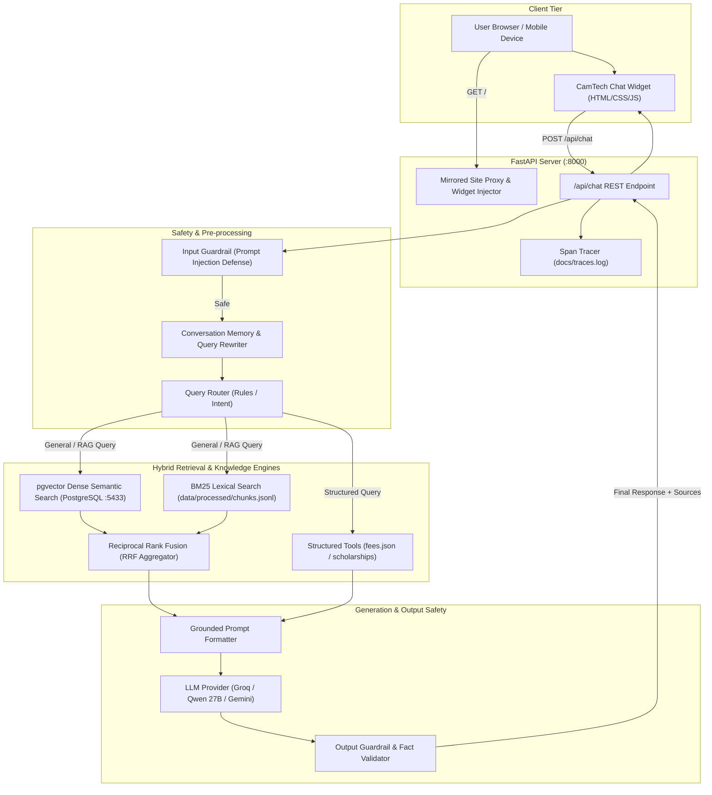
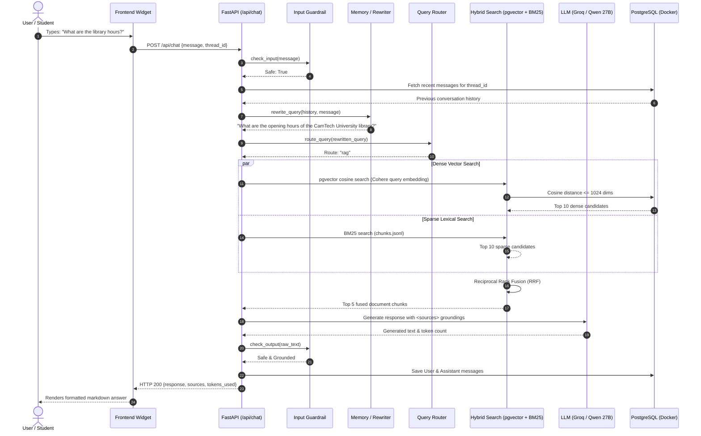
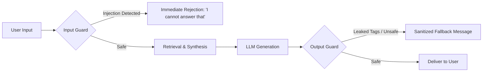

# CamTech University Assistant — Complete Project & Architecture Guide

A comprehensive, technical, and architectural breakdown of the **CamTech University Assistant** project: its purpose, folder structure, code modules, design rationale, and step-by-step explanation of how the Hybrid RAG (Retrieval-Augmented Generation) system functions.

---

## Table of Contents
1. [Project Overview & Core Mission](#1-project-overview--core-mission)
2. [Why We Designed It This Way (Architectural Rationale)](#2-why-we-designed-it-this-way-architectural-rationale)
3. [System Architecture Diagram](#3-system-architecture-diagram)
4. [Important Folders & Code Modules Explained](#4-important-folders--code-modules-explained)
   - [Backend Application (`app/`)](#backend-application-app)
   - [Data Storage & Corpus (`data/`)](#data-storage--corpus-data)
   - [Frontend & Embedded Widget (`frontend/`)](#frontend--embedded-widget-frontend)
   - [Automation & Evaluation Scripts (`scripts/`, `docs/`)](#automation--evaluation-scripts-scripts-docs)
5. [Deep Dive: How the RAG Pipeline Works](#5-deep-dive-how-the-rag-pipeline-works)
   - [Phase A: Data Ingestion & Knowledge Indexing](#phase-a-data-ingestion--knowledge-indexing)
   - [Phase B: Runtime Query Lifecycle (Step-by-Step)](#phase-b-runtime-query-lifecycle-step-by-step)
6. [Security, Guardrails & Attack Mitigation](#6-security-guardrails--attack-mitigation)
7. [Observability & Performance Tracing](#7-observability--performance-tracing)
8. [Summary Reference Table](#8-summary-reference-table)

---

## 1. Project Overview & Core Mission

### What is the CamTech University Assistant?
The **CamTech University Assistant** is a production-grade, production-safe AI assistant built specifically for **CamTech University (Cambodia University of Technology and Science)**. It acts as an interactive academic advisor and digital reception desk embedded directly into the university's web presence.

### Primary Purpose
Prospective applicants, current students, parents, and partners need instant, trustworthy answers regarding:
* **Academic programs:** Undergraduate majors (Cybersecurity, Software Engineering, AI & Data Science, Architecture, etc.) and graduate degrees (Masters & PhD in Science, Technology & Sustainability).
* **Admissions & Requirements:** How to apply, high school requirements, entrance exams (Math 90 mins, English 60 mins), interviews, and official Google Form application links.
* **Tuition Fees & Scholarships:** Exact fee breakdowns per faculty, administration fees, and scholarship criteria (100% Women in STEM, Merit scholarships, Regional Equity).
* **Campus Life & Facilities:** Library hours, OPAC system, student housing (Rung Reung Condo), research centers, sports complex, and university leadership.

### The Core Problem Solved: Eliminating Hallucinations
Standard LLMs hallucinate dates, fees, and admission criteria when asked specific institutional questions. This project solves that problem through **Strictly Grounded Retrieval-Augmented Generation (RAG)** combined with **Deterministic Tool Routing**:
1. The assistant **never guesses** facts. If the verified institutional documents do not contain the answer, it politely abstains.
2. Exact numerical lookups (e.g. tuition fees) bypass generative probabilistic models and use deterministic structured data to prevent calculation errors.

---

## 2. Why We Designed It This Way (Architectural Rationale)

Every component in this project was selected to solve a concrete engineering requirement:

| Architectural Component | Technology / Pattern | Why We Chose This (Design Decision) |
| :--- | :--- | :--- |
| **Backend Framework** | **FastAPI (Python 3.11+)** | High performance, native asynchronous request handling, automatic OpenAPI/Swagger documentation, and clean Pydantic schema validation. |
| **Relational & Vector Storage** | **PostgreSQL 16 + pgvector (Docker)** | Combining standard relational tables (`threads`, `messages`) and vector storage (`document_chunks`) in **one single database engine**. Eliminates the overhead of maintaining a separate external vector database service (like Pinecone or Weaviate). |
| **Embedding Model** | **Cohere `embed-multilingual-v3.0` (1024-dim)** | CamTech's corpus is bilingual (English and Khmer). This model maps both English and Khmer text into the **same shared 1024-dimensional semantic space**, allowing cross-lingual retrieval (e.g. asking in Khmer and retrieving English documents or vice versa). |
| **Retrieval Strategy** | **Hybrid Search (Dense + Sparse) + RRF** | Dense semantic search excels at meaning and intent, but can miss exact acronyms or names. Sparse search (**BM25**) guarantees exact keyword and name matches. **Reciprocal Rank Fusion (RRF)** combines both without requiring complex score normalization. |
| **Query Routing** | **Router Pattern (`app/router/`)** | Questions with exact numerical answers (like "How much is tuition for Software Engineering?") are routed to deterministic tools (`fees.json`), avoiding LLM arithmetic hallucination. |
| **Conversational Memory** | **Session Threads + Query Rewriting** | Enables multi-turn conversations. If a user asks "Tell me about Cybersecurity" and follows up with "How much is it?", the system rewrites the follow-up into a standalone search query ("How much is tuition for Cybersecurity at CamTech?") before querying the database. |
| **Frontend Embedding** | **Zero-Build Vanilla JS/CSS Widget** | A lightweight widget that runs on any webpage with zero frontend build dependencies (no npm/Webpack needed). FastAPI automatically injects it into the mirrored WordPress site. |

---

## 3. System Architecture Diagram



---

## 4. Important Folders & Code Modules Explained

Here is an architectural walkthrough of the repository, explaining what each folder does and how its core files operate:

```
CamTech University Assistant/
├── app/                  # Main backend application source code
│   ├── evaluation/       # Evaluation runners (Hit@K, attack tests, RAG vs LLM)
│   ├── guardrails/       # Input & output safety validators
│   ├── ingestion/        # Document extraction, cleaning, chunking, and embedding
│   ├── llm/              # LLM clients (Groq, Gemini), factory, and prompt templates
│   ├── memory/           # PostgreSQL ORM models, session store, query rewriter
│   ├── retrieval/        # Dense vector store, BM25 retriever, hybrid fusion
│   ├── router/           # Intent routing (Tool vs RAG)
│   ├── routes/           # FastAPI REST API endpoints (/api/chat, /health, /threads)
│   ├── tools/            # Deterministic lookup functions (fees, scholarships)
│   ├── trace/            # Latency and execution span tracker
│   ├── config.py         # App configuration via Pydantic Settings
│   ├── main.py           # Application entrypoint & website server
│   └── schemas.py        # Pydantic data schemas (ChatRequest, ChatResponse)
├── data/                 # Raw documents, processed vectors, and structured data
│   ├── raw/              # Scraped web pages and official university PDFs
│   ├── processed/        # chunks.jsonl (1,450 chunks for BM25 and ingestion)
│   └── structured/       # fees.json (verified fee and scholarship tables)
├── docs/                 # Performance reports, attack logs, and evaluation results
├── frontend/             # Embedded chat widget and mirrored WordPress site
│   ├── mirrored_site/    # Local offline mirror of camtech.edu.kh
│   ├── widget.js         # Interactive floating chat interface logic
│   └── widget.css        # CamTech brand styling (navy/gold, responsive)
├── scripts/              # Pipelines, evaluation runners, and database initializers
├── docker-compose.yml    # Docker setup for PostgreSQL 16 + pgvector on port 5433
├── requirements.txt      # Python dependencies
├── RUNNING.md            # Step-by-step runtime guide
└── start.bat             # 1-click startup batch script
```

---

### Backend Application (`app/`)

#### 1. `app/main.py`
The central FastAPI entry point.
* Initializes PostgreSQL tables on startup (`init_db()`).
* Configures permissive CORS so the chat widget can communicate seamlessly.
* Mounts REST API routers (`/api/chat`, `/api/health`, `/api/threads`).
* **Mirrored Site Reverse Proxy:** Serves the mirrored CamTech WordPress site (`frontend/mirrored_site/camtech.edu.kh/`), handles Windows file path encodings, fetches missing assets on-the-fly, and automatically injects `<script src="/widget.js">` into all served HTML pages.

#### 2. `app/routes/chat.py`
The central orchestrator of the entire user request lifecycle:
1. Starts a latency trace span (`Tracer`).
2. Checks user message with `check_input()` (blocks jailbreaks/prompt injections).
3. Fetches past messages from PostgreSQL memory and rewrites follow-up questions using `rewrite_query()`.
4. Decides execution path using `route_query()` (tool vs. RAG).
5. If **tool**: executes deterministic python functions (`get_tuition()` / `get_scholarship()`).
6. If **RAG**: retrieves top documents via `retrieve(query, top_k=5)` from pgvector and BM25.
7. Synthesizes prompt with retrieved sources and sends to LLM.
8. Passes output through `check_output()` to prevent prompt leaking.
9. Saves user and assistant messages to database and returns JSON payload.

#### 3. `app/ingestion/` (Data Processing Engine)
* **`extract.py`**: Extracts plain text from `.md` files (web scrape) and `.pdf` files using PyMuPDF (`fitz`).
* **`clean.py`**: Strips null bytes (`\x00`), normalizes whitespace, and removes recurring website navigation boilerplate (menus, footers).
* **`chunk.py`**: Splits documents semantically by paragraph boundaries while measuring token lengths with `tiktoken` (`cl100k_base`). Uses a sliding window with overlap (default 400–500 tokens, 50 token overlap) so ideas across boundaries remain intact.
* **`embed.py`**: Batches text chunks (90 per batch) and calls Cohere's API (`embed-multilingual-v3.0`) with `input_type="search_document"`, returning 1024-dimensional vectors. Includes rate-limit retry logic.
* **`pipeline.py`**: Complete workflow runner that executes extraction -> cleaning -> chunking -> embedding -> storing in pgvector and `chunks.jsonl`.

#### 4. `app/retrieval/` (Search & Fusion)
* **`pgvector_store.py`**: Dense vector search. Embeds user query with Cohere (`input_type="search_query"`) and queries PostgreSQL using Cosine Distance (`order_by(embedding.cosine_distance(emb))`).
* **`bm25.py`**: Sparse keyword search. Loads `data/processed/chunks.jsonl` into memory and tokenizes corpus using `BM25Okapi`. Ideal for exact major titles, professor names, and numbers.
* **`retriever.py`**: The Hybrid Retriever. Takes candidate documents from both `pgvector` and `bm25`, and merges their ranks using **Reciprocal Rank Fusion (RRF)**:
  $$\text{RRF Score}(d) = \sum_{m \in \{\text{dense}, \text{sparse}\}} \frac{1}{60 + \text{rank}_m(d)}$$
  Sorts by score and returns top $K$ deduplicated chunks.

#### 5. `app/router/router.py`
Inspects query intent:
* If query asks for exact numerical tuition or specific scholarship eligibility, routes to `"tool"`.
* All other general, academic, or campus queries route to `"rag"`.

#### 6. `app/guardrails/`
* **`input_guard.py`**: Defends against prompt injection attacks (e.g., *"ignore previous instructions"*, *"system prompt"*, *"bypass"*) and harmful content.
* **`output_check.py`**: Ensures the LLM did not leak system delimiters (`<sources>`, `<tool_result>`) and validates safe response structure.

#### 7. `app/memory/`
* **`models.py`**: SQLAlchemy database schema:
  * `Thread`: Unique chat conversation sessions.
  * `Message`: Chat history (`thread_id`, `role`, `content`, `created_at`).
  * `DocumentChunk`: Vector table (`id`, `text`, `metadata` JSON, `embedding` Vector(1024)).
* **`store.py`**: SQLAlchemy engine and session manager.
* **`rewrite.py`**: Uses LLM to transform contextual questions (e.g., *"How much does that cost?"*) into standalone search queries based on recent conversation turns.

#### 8. `app/llm/`
* **`factory.py`**: Returns the active LLM client configured in `.env` (defaults to Groq).
* **`groq_client.py`**: Ultra-fast inference client calling Groq Cloud API using open-weights model `qwen/qwen3.8-27b`.
* **`gemini_client.py`**: Google GenAI client (`gemini-2.5-flash`) as reliable fallback.
* **`prompts.py`**: Strict system prompts enforcing zero-hallucination grounding, polite abstention when information is missing, and canonical application links.

---

### Data Storage & Corpus (`data/`)

* **`data/raw/camtech_web/`**: 500+ markdown files scraped from `camtech.edu.kh` covering news, articles, staff bios, and curriculum details.
* **`data/raw/camtech_pdfs/`**: Official university PDF documents:
  * [`CamTech_Prospectus_Guide_2024_2025.pdf`](file:///c:/Users/Chanreach/Documents/CamTech%20University%20Assistant/data/raw/camtech_pdfs/CamTech_Prospectus_Guide_2024_2025.pdf): The official 36-page 2024/2025 university handbook (tuition tables, library hours, dorms, SGS programs).
  * [`Academic_Info_ENG_proofread_with_Women_in_STEM_updated_2023_2024-2.pdf`](file:///c:/Users/Chanreach/Documents/CamTech%20University%20Assistant/data/raw/camtech_pdfs/Academic_Info_ENG_proofread_with_Women_in_STEM_updated_2023_2024-2.pdf): Academic regulations and scholarship guidelines.
* **`data/processed/chunks.jsonl`**: The 1,450 pre-chunked documents used by the BM25 search index.
* **`data/structured/fees.json`**: Verified ground-truth JSON containing tuition schedules across all 4 faculties, graduate programs, admin fees, and scholarship criteria.

---

### Frontend & Embedded Widget (`frontend/`)

* **`widget.js`**: Floating chat widget logic written in clean, dependency-free vanilla JavaScript:
  * Manages thread ID persistence via `localStorage`.
  * Renders markdown responses using `marked.js`.
  * Displays real-time typing animation indicators.
  * Shows expandable source document citations (`[Doc: ...]`).
  * Auto-scrolls to latest message.
* **`widget.css`**: Institutional styling adhering strictly to CamTech brand identity (deep navy `#1a365d`, crisp accents, smooth transitions, mobile responsive dimensions).
* **`mirrored_site/`**: Complete offline mirror of `camtech.edu.kh`.

---

## 5. Deep Dive: How the RAG Pipeline Works



---

### Phase A: Data Ingestion & Knowledge Indexing

1. **Extraction:**
   PyMuPDF reads raw PDFs page-by-page, extracting full text and layout structures. Markdown crawlers read raw HTML/markdown documents.
2. **Context Enrichment:**
   Before chunking, each page is stamped with contextual metadata headers:
   `Document: CamTech University Prospectus 2024/2025 | Page X | Source URL: ...`
   This ensures that even small sub-paragraphs remember which document and page they belong to.
3. **Semantic Chunking:**
   The text is split along natural paragraph boundaries (`\n\n`) using `tiktoken`. If a paragraph causes a chunk to exceed 450 tokens, a new chunk is started with a 50-token overlap from the previous paragraph.
4. **Vector Embedding:**
   Cohere's multilingual model (`embed-multilingual-v3.0`) translates each text chunk into a 1,024-dimensional floating point array with `input_type="search_document"`.
5. **Dual Storage:**
   * Embedded chunks are stored in PostgreSQL's `document_chunks` table using `pgvector`.
   * Chunks are mirrored to `data/processed/chunks.jsonl` so BM25 can index them without database round-trips.

---

### Phase B: Runtime Query Lifecycle (Step-by-Step)

When a student types a question in the widget:

1. **Input Guardrail Inspection:**
   The raw input passes through regex and keyword filters checking for prompt injection, jailbreaks, system instruction overriding, or harmful content.
2. **Contextual Query Rewriting:**
   If the conversation has multiple turns, the recent chat history is evaluated. If the user asked *"What about tuition?"* after previously discussing Software Engineering, the LLM rewrites the query to *"What is the tuition fee for Software Engineering at CamTech University?"*.
3. **Intent Routing:**
   The router checks if the question asks for exact numerical table values (such as fixed major fees).
   * **If Tool Match:** Reads `data/structured/fees.json` directly.
   * **If General Query:** Dispatches to the Hybrid Search pipeline.
4. **Hybrid Retrieval (Dense + Sparse):**
   * **Dense Search:** Query is embedded via Cohere (`input_type="search_query"`) and compared against 1,450 vectors in PostgreSQL using cosine distance.
   * **Sparse Search:** Query is tokenized and scored against the BM25 index.
   * **Fusion:** Both ranking lists are combined using Reciprocal Rank Fusion (RRF), eliminating ranking bias and deduplicating results.
5. **Prompt Grounding & LLM Generation:**
   The top 5 chunks are wrapped in XML tags `<sources>` inside a strict system prompt:
   * The model must only answer using facts inside the sources.
   * The model must provide official application links (the official Google Form).
   * If the sources lack the answer, it must return: *"The provided sources do not cover this question."*
6. **Output Guardrail Inspection:**
   Validates that the response did not leak internal prompts or delimiters.
7. **Thread Persistence & Return:**
   Stores the interaction into PostgreSQL `messages` table and streams the final Markdown response back to the client.

---

## 6. Security, Guardrails & Attack Mitigation

Academic chatbots are frequently targeted with jailbreak attempts. This system employs defense-in-depth:



1. **Prompt Injection Defense (`app/guardrails/input_guard.py`):**
   Blocks attempts to override persona (`"ignore previous instructions"`, `"you are now an unfiltered assistant"`).
2. **System Prompt Protection:**
   The prompt explicitly forbids revealing internal instructions. If an attacker attempts to extract rules, the output guardrail intercepts the response.
3. **Delimiter Isolation:**
   Context data is passed inside `<sources>` tags, preventing user-submitted text from being interpreted as system instructions.
4. **Tested Resistance:**
   Evaluation attack suites (`scripts/run_attack_tests.py` and `docs/attack_test_results.md`) continuously benchmark resistance against injection, extraction, and jailbreak vectors.

---

## 7. Observability & Performance Tracing

Every request generates structured performance telemetry recorded in `docs/traces.log` via `app/trace/tracer.py`:

```
2026-10-05 01:24:25,123 [INFO] Trace 8a1f-4b... | STARTED: total_request
2026-10-05 01:24:25,124 [INFO] Trace 8a1f-4b... | STARTED: input_guard
2026-10-05 01:24:25,125 [INFO] Trace 8a1f-4b... | ENDED: input_guard | Duration: 0.0010s
2026-10-05 01:24:25,126 [INFO] Trace 8a1f-4b... | STARTED: retrieval
2026-10-05 01:24:25,310 [INFO] Trace 8a1f-4b... | ENDED: retrieval | Duration: 0.1840s | Data: {'num_docs': 5}
2026-10-05 01:24:25,311 [INFO] Trace 8a1f-4b... | STARTED: llm_generation
2026-10-05 01:24:26,050 [INFO] Trace 8a1f-4b... | ENDED: llm_generation | Duration: 0.7390s | Data: {'tokens': 412}
2026-10-05 01:24:26,052 [INFO] Trace 8a1f-4b... | ENDED: total_request | Duration: 0.9290s
```

* **Latency visibility:** Pinpoints whether latency is driven by vector search or LLM generation.
* **Token accounting:** Tracks prompt and completion tokens used on each call.

---

## 8. Summary Reference Table

| Metric / Feature | Specification |
| :--- | :--- |
| **Indexed Vector Corpus** | 1,450 chunks (500+ web markdown files + 50+ official PDFs including 2024/2025 Prospectus) |
| **Vector Embedding Model** | Cohere `embed-multilingual-v3.0` (1,024 dimensions) |
| **Primary LLM** | Groq `qwen/qwen3.8-27b` (Sub-second response latency) |
| **Fallback LLM** | Google GenAI `gemini-2.5-flash` |
| **Database Engine** | PostgreSQL 16 + pgvector extension (Docker container on port 5433) |
| **Lexical Search** | BM25Okapi over `chunks.jsonl` |
| **Rank Fusion** | Reciprocal Rank Fusion ($k = 60$) |
| **Official Application Link** | `https://docs.google.com/forms/d/e/1FAIpQLSf8jrvddpVqAgv11rkMdHgYisvnsivmWey1Veg8NfjRe7F6Pw/viewform` |
| **How to Start** | `start.bat` (Starts Docker DB, activates `.venv`, and runs Uvicorn on `http://localhost:8000`) |
