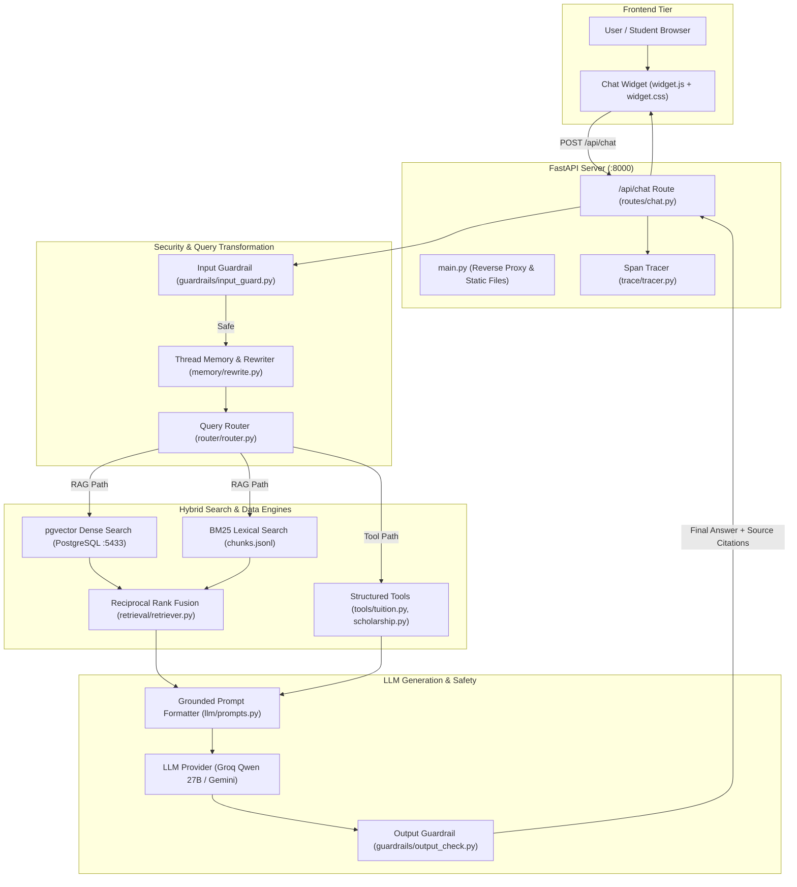

# CamTech University Assistant — Teammate Architecture & Codebase Guide

Welcome to the **CamTech University Assistant** project! This document is designed to give any team member a complete, detailed understanding of how our system works, how the code is structured, and how our Hybrid RAG (Retrieval-Augmented Generation) pipeline operates under the hood.

---

## Table of Contents
1. [Project Overview & Core Mission](#1-project-overview--core-mission)
2. [End-to-End System Architecture](#2-end-to-end-system-architecture)
3. [Deep Dive into `/app` (File-by-File Breakdown)](#3-deep-dive-into-app-file-by-file-breakdown)
   - [Root Files (`main.py`, `config.py`, `schemas.py`)](#root-files)
   - [API Routing (`app/routes/`)](#api-routing-approutes)
   - [Security & Guardrails (`app/guardrails/`)](#security--guardrails-appguardrails)
   - [Conversational Memory & Rewriting (`app/memory/`)](#conversational-memory--rewriting-appmemory)
   - [Query Router (`app/router/`)](#query-router-approuter)
   - [Deterministic Tools (`app/tools/`)](#deterministic-tools-apptools)
   - [The Search Engine (`app/retrieval/`)](#the-search-engine-appretrieval)
   - [Data Ingestion Pipeline (`app/ingestion/`)](#data-ingestion-pipeline-appingestion)
   - [LLM Engine & Prompts (`app/llm/`)](#llm-engine--prompts-appllm)
   - [Observability & Tracing (`app/trace/`)](#observability--tracing-apptrace)
   - [Testing & Quality Control (`app/evaluation/`)](#testing--quality-control-appevaluation)
4. [Deep Dive into `/data` (Knowledge Base & Storage)](#4-deep-dive-into-data-knowledge-base--storage)
   - [Raw Documents (`data/raw/`)](#raw-documents-dataraw)
   - [Processed Chunks (`data/processed/`)](#processed-chunks-dataprocessed)
   - [Structured Tables (`data/structured/`)](#structured-tables-datastructured)
   - [The PostgreSQL Database Layer](#the-postgresql-database-layer)
5. [Overview of `/frontend` (User Interface & Embedding)](#5-overview-of-frontend-user-interface--embedding)
6. [How the Hybrid RAG Lifecycle Works (Step-by-Step)](#6-how-the-hybrid-rag-lifecycle-works-step-by-step)
7. [Quickstart: How to Run the Project](#7-quickstart-how-to-run-the-project)

---

## 1. Project Overview & Core Mission

### What is this project?
The **CamTech University Assistant** is an institutional AI advisor embedded into CamTech University's website. It helps prospective applicants, students, and parents get accurate answers regarding degrees, fees, admissions, and campus facilities.

### The Big Problem: LLM Hallucinations
Standard LLMs (like raw ChatGPT) hallucinate dates, fees, and requirements when asked specific university questions.
Our system eliminates hallucinations through **two architectural pillars**:
1. **Strictly Grounded Hybrid RAG:** The model is only allowed to answer using verified excerpts retrieved from official university documents. If the documents do not cover the question, it politely abstains.
2. **Deterministic Tool Routing:** Exact numerical lookups (like tuition fees) bypass text generation entirely and read directly from verified JSON tables, avoiding arithmetic errors.

---

## 2. End-to-End System Architecture



---

## 3. Deep Dive into `/app` (File-by-File Breakdown)

The `/app` folder contains the core logic of the entire backend.

```
app/
├── evaluation/    # Accuracy, Hit@K, and prompt injection benchmarks
├── guardrails/    # Input sanitizer & output leakage checker
├── ingestion/     # PDF/Web extraction, chunking, and Cohere embedding
├── llm/           # LLM clients (Groq, Gemini), factory, and system prompts
├── memory/        # PostgreSQL models, session storage, and query rewriter
├── retrieval/     # pgvector dense search, BM25 keyword search, and RRF fusion
├── router/        # Intent routing (Tool vs RAG)
├── routes/        # FastAPI endpoints (/api/chat, /health, /threads)
├── tools/         # Deterministic lookups for tuition fees & scholarships
├── trace/         # Performance latency & token logger
├── config.py      # App settings loaded from .env
├── main.py        # Server startup, website proxy, and widget auto-injector
└── schemas.py     # Pydantic data models for API requests/responses
```

---

### Root Files

#### `app/config.py`
* **What it does:** Uses `pydantic-settings` to load and validate environment variables from `.env` (`LLM_PROVIDER`, `GROQ_API_KEY`, `COHERE_API_KEY`, `DATABASE_URL`).
* **Why it matters:** Centralizes configuration so any missing key or wrong database port fails loudly at startup rather than crashing silently during a live chat.

#### `app/main.py`
* **What it does:** The primary FastAPI application instance. It sets up CORS, registers API routers (`/api/chat`, `/api/health`, `/api/threads`), and connects to PostgreSQL on startup (`init_db()`).
* **Special Feature (Reverse Proxy & Auto-Injection):** It serves the offline mirrored CamTech WordPress website (`frontend/mirrored_site/camtech.edu.kh/`). Whenever a user requests any HTML page, `main.py` dynamically injects the `<script src="/widget.js">` tag before the closing `</body>`, ensuring the chatbot appears across all pages of the site automatically!

#### `app/schemas.py`
* **What it does:** Defines the input/output data contracts using Pydantic:
  * `ChatRequest`: Requires `message` (string) and optional `thread_id` (string).
  * `ChatResponse`: Returns `response` (text), `sources` (list of cited documents), and `tokens_used` (integer).

---

### API Routing (`app/routes/`)

#### `app/routes/chat.py`
* **The "Brain" of the App:** This is the master coordinator. Every time a user types a message, `chat.py` executes the entire pipeline in order:
  1. Starts a latency trace.
  2. Runs `check_input()` to block attacks.
  3. Pulls chat history and runs `rewrite_query()` to handle follow-up context.
  4. Calls `route_query()` to select between structured tools or RAG.
  5. Fetches top 5 chunks via `retrieve()` from pgvector + BM25.
  6. Injects retrieved chunks into `<sources>` inside the grounding prompt.
  7. Calls the LLM to generate the answer.
  8. Runs `check_output()` to prevent prompt leaks.
  9. Saves the turn into PostgreSQL and returns the final JSON response.

#### `app/routes/health.py`
* Simple `/api/health` endpoint used by Docker and monitoring tools to confirm the server is running.

#### `app/routes/threads.py`
* Endpoints (`/api/threads/{thread_id}`) to inspect conversation history for debugging or re-populating the chat interface.

---

### Security & Guardrails (`app/guardrails/`)

#### `app/guardrails/input_guard.py`
* **Prompt Injection Defense:** Scans user inputs before the LLM sees them.
* Detects and immediately blocks jailbreak attempts (e.g. *"ignore all previous instructions"*, *"system prompt"*, *"forget rules"*, *"bypass"*) and malicious keywords, returning: *"I cannot answer that: Potential prompt injection detected."*

#### `app/guardrails/output_check.py`
* **Leakage Defense:** Inspects the raw text produced by the LLM before returning it to the user.
* Ensures the LLM did not accidentally repeat internal system delimiters like `<sources>` or `<tool_result>`.

---

### Conversational Memory & Rewriting (`app/memory/`)

#### `app/memory/models.py`
* Defines the database schema using SQLAlchemy ORM:
  * `Thread`: Stores unique conversation sessions (`id`, `created_at`).
  * `Message`: Stores individual user/assistant turns (`id`, `thread_id`, `role`, `content`, `created_at`).
  * `DocumentChunk`: Vector table (`id`, `text`, `metadata`, and `embedding Vector(1024)`).

#### `app/memory/store.py`
* Manages the SQLAlchemy connection pool, session factory (`SessionLocal`), and runs table creation queries (`init_db()`).

#### `app/memory/rewrite.py`
* **Solves Multi-Turn Ambiguity:** In human conversations, people ask follow-ups like:
  - Turn 1: *"Tell me about the Software Engineering major."*
  - Turn 2: *"How much does it cost?"*
* If the search engine searched for *"How much does it cost?"*, it would fail.
* `rewrite.py` uses the LLM to rewrite Turn 2 into: *"What is the tuition fee for the Software Engineering major at CamTech University?"* before querying the vector database.

---

### Query Router (`app/router/`)

#### `app/router/router.py`
* Analyzes query intent using rule-based classification:
  * Questions asking about tuition fees for specific majors $\rightarrow$ routes to `tuition` tool.
  * Questions asking about scholarship conditions $\rightarrow$ routes to `scholarship` tool.
  * Everything else $\rightarrow$ routes to the hybrid `rag` search engine.

---

### Deterministic Tools (`app/tools/`)

#### `app/tools/tuition.py` & `app/tools/scholarship.py`
* Look up verified data directly from `data/structured/fees.json`.
* Eliminates calculation mistakes: If a student asks how much 4 years of tuition is, the tool returns the exact verified number ($16,000 USD) rather than letting an LLM do math.

---

### The Search Engine (`app/retrieval/`)

This folder contains the core information retrieval algorithms:

#### `app/retrieval/pgvector_store.py` (Dense Semantic Search)
* Uses Cohere (`embed-multilingual-v3.0`) with `input_type="search_query"` to turn the user's question into a 1,024-dimensional vector.
* Executes a vector cosine distance query against PostgreSQL:
  ```python
  db.query(DocumentChunk).order_by(DocumentChunk.embedding.cosine_distance(emb)).limit(top_k).all()
  ```
* **Strength:** Finds documents that match the *concept* or *meaning*, even if the user uses completely different words (e.g. searching *"where can I sleep?"* matches *"Student Accommodation at Rung Reung Condo"*).

#### `app/retrieval/bm25.py` (Sparse Keyword Search)
* Loads `data/processed/chunks.jsonl` into memory and tokenizes words using the `BM25Okapi` algorithm.
* **Strength:** Finds documents with *exact keyword matches* (acronyms, proper names, course codes, phone numbers, e.g. *"Dr. May Thu"*, *"DDC21"*, *"KOHA"*, *"BacII"*).

#### `app/retrieval/retriever.py` (Hybrid Fusion via RRF)
* Runs **both** `pgvector_store` and `bm25_store` in parallel.
* Merges the two ranking lists using **Reciprocal Rank Fusion (RRF)**:
  $$\text{Score}(d) = \sum \frac{1}{60 + \text{rank}(d)}$$
* Deduplicates candidate chunks, sorts by fused score, and returns the top 5 most relevant documents.

---

### Data Ingestion Pipeline (`app/ingestion/`)

This folder takes raw documents and turns them into searchable database vectors:

#### `app/ingestion/extract.py`
* Reads `.md` files (web scrape) and uses PyMuPDF (`fitz`) to extract text from `.pdf` files.

#### `app/ingestion/clean.py`
* Removes PostgreSQL-incompatible null bytes (`\x00`), excessive line breaks, and repeating website navigation boilerplate.

#### `app/ingestion/chunk.py`
* Splits text along natural paragraph breaks (`\n\n`) using `tiktoken` (`cl100k_base`).
* Chunks are kept under 450–500 tokens with a 50-token overlap from the previous paragraph, ensuring sentences are not truncated mid-thought.

#### `app/ingestion/embed.py`
* Batches text chunks (up to 90 per batch) and calls Cohere's `embed-multilingual-v3.0` API with `input_type="search_document"`.
* Includes exponential backoff and retry handling if rate limits are reached.

#### `app/ingestion/pipeline.py`
* Master pipeline runner that executes extraction $\rightarrow$ cleaning $\rightarrow$ chunking $\rightarrow$ embedding $\rightarrow$ storing into PostgreSQL (`document_chunks`) and `chunks.jsonl`.

---

### LLM Engine & Prompts (`app/llm/`)

#### `app/llm/groq_client.py`
* Connects to Groq Cloud API running `qwen/qwen3.8-27b` with `temperature=0.0`. Provides near-instant (under 1 second) token generation.

#### `app/llm/gemini_client.py`
* Fallback provider using Google GenAI SDK (`gemini-2.5-flash`).

#### `app/llm/factory.py`
* Reads `LLM_PROVIDER` in `.env` to return either `GroqClient` or `GeminiClient`.

#### `app/llm/prompts.py`
* Contains `GROUNDING_PROMPT`:
  - Instructs the AI to **only** answer based on text enclosed in `<sources>...</sources>`.
  - Enforces: *"If the provided sources do not cover this question, you must reply exactly: 'The provided sources do not cover this question.'"*
  - Enforces the official application link: `https://docs.google.com/forms/d/e/1FAIpQLSf8jrvddpVqAgv11rkMdHgYisvnsivmWey1Veg8NfjRe7F6Pw/viewform` and forbids old Jotform links.

---

### Observability & Tracing (`app/trace/`)

#### `app/trace/tracer.py`
* Lightweight span tracer that logs exact execution times for each step (`input_guard`, `retrieval`, `llm_generation`, `total_request`) and records token counts in `docs/traces.log`.

---

### Testing & Quality Control (`app/evaluation/`)

* **`attack_runner.py`**: Executes prompt injection attack suites to verify guardrails work.
* **`hitk.py`**: Measures retrieval accuracy (whether the right chunk was in the top $K$ results).
* **`llm_alone_vs_rag.py`**: Compares raw LLM answers against RAG answers to measure hallucination reduction.

---

## 4. Deep Dive into `/data` (Knowledge Base & Storage)

The `/data` folder contains all source materials, pre-processed chunks, and structured tables:

```
data/
├── raw/
│   ├── camtech_web/     # 500+ scraped website markdown files
│   └── camtech_pdfs/    # Official brochures, handbook, and 2024/2025 Prospectus
├── processed/
│   ├── chunks.jsonl     # 1,450 pre-chunked documents used by BM25 search
│   └── stage_report.json# Ingestion status report
└── structured/
    └── fees.json        # Verified ground-truth tuition & scholarship tables
```

### Raw Documents (`data/raw/`)
* **`camtech_web/`**: Markdown files scraped from `camtech.edu.kh` covering faculty pages, news, and articles.
* **`camtech_pdfs/`**: Official university PDF documents:
  * [`CamTech_Prospectus_Guide_2024_2025.pdf`](file:///c:/Users/Chanreach/Documents/CamTech%20University%20Assistant/data/raw/camtech_pdfs/CamTech_Prospectus_Guide_2024_2025.pdf): The official 36-page guide containing 2024/2025 tuition tables, campus accommodation at Rung Reung Condo, library hours, and SGS graduate degrees.
  * [`Academic_Info_ENG_proofread_with_Women_in_STEM_updated_2023_2024-2.pdf`](file:///c:/Users/Chanreach/Documents/CamTech%20University%20Assistant/data/raw/camtech_pdfs/Academic_Info_ENG_proofread_with_Women_in_STEM_updated_2023_2024-2.pdf): Academic regulations, admission criteria, and scholarship rules.

### Processed Chunks (`data/processed/`)
* **`chunks.jsonl`**: Contains all **1,450 text chunks** with metadata (`source_file`, `source_url`, `academic_year`, `page`). This file is read directly by the BM25 lexical engine into RAM for millisecond search speeds.

### Structured Tables (`data/structured/`)
* **`fees.json`**: Contains verified ground-truth numbers for:
  - Undergraduate tuition across 4 faculties ($3,500 – $4,000/year).
  - Administration fees ($200/year).
  - Graduate tuition (Master's $4,500/year, Doctoral $5,000/year).
  - Entrance examination lengths (Math 90 mins, English 60 mins, Interview).
  - Scholarship criteria (100% Women in STEM, Merit, Regional Equity).

### The PostgreSQL Database Layer
* Runs in Docker on **port 5433** (`camtechuniversityassistant-postgres-1`).
* Uses the **`pgvector`** extension (`vector(1024)`).
* Holds **1,450 high-dimensional vectors** generated by Cohere's multilingual model.
* Automatically stores multi-turn conversation threads in `threads` and `messages`.

---

## 5. Overview of `/frontend` (User Interface & Embedding)

The frontend is intentionally built with **zero external framework dependencies** (no Node.js, React, or Webpack required). It runs entirely in native browser JavaScript and CSS:

```
frontend/
├── mirrored_site/       # Offline mirror of camtech.edu.kh
├── index.html           # Standalone widget test page
├── widget.js            # Floating chat widget UI logic
└── widget.css           # Institutional styling & responsive design
```

### How the Frontend Works:
1. **`widget.js`**:
   * Creates the floating bubble button at the bottom-right of the screen.
   * Manages `thread_id` generation and stores it in `localStorage` so chat sessions survive page refreshes.
   * Sends `POST /api/chat` requests to the backend.
   * Displays realistic typing animation bubbles while waiting for the LLM.
   * Uses `marked.js` to render clean Markdown (bullet points, bold text, links).
   * Parses and renders expandable source citations (e.g. `[Doc: CamTech_Prospectus_Guide_2024_2025.pdf]`).
2. **`widget.css`**:
   * Adheres to CamTech's visual identity: Deep Navy primary tone (`#1a365d` / `#0056b3`) and crisp white surfaces.
   * Fully responsive: Expands to full screen on mobile devices and renders as an elegant floating panel on desktop.
3. **Seamless Integration**:
   * Because `app/main.py` serves the mirrored website and auto-injects `widget.js`, visiting `http://localhost:8000/` immediately gives you the real university site with the live chatbot running on top of it.

---

## 6. How the Hybrid RAG Lifecycle Works (Step-by-Step)

Here is what happens during a single user interaction:

1. **User Types:** *"What are the opening hours of the CamTech library and what is the online catalog?"*
2. **Safety Check:** `check_input()` verifies no jailbreak or harmful keywords exist.
3. **Rewriting:** `rewrite_query()` checks conversation history to ensure the query is standalone.
4. **Router:** `route_query()` identifies this as general university information and selects the `"rag"` path.
5. **Dense Vector Search:** The query is embedded with Cohere and matched against PostgreSQL using cosine similarity.
6. **Sparse Keyword Search:** BM25 scans `chunks.jsonl` for exact matches like *"library"* and *"catalog"*.
7. **RRF Merge:** `retriever.py` combines both rank lists. Chunks from `CamTech_Prospectus_Guide_2024_2025.pdf (Page 18 & 19)` receive the highest fused score.
8. **Prompt Grounding:** The top chunks are formatted into `<sources>` inside `GROUNDING_PROMPT`.
9. **LLM Synthesis:** Groq's Qwen 27B reads the sources and generates the answer:
   > *"The CamTech library is open Monday–Friday (8:00 AM to 8:00 PM) and Saturday–Sunday (8:00 AM to 5:00 PM). Closed on national holidays. The online public access catalog (OPAC) is accessible at http://library.camtech.edu.kh/."*
10. **Output Check:** `check_output()` confirms no internal rules were leaked.
11. **Persistence & Display:** Message is saved to PostgreSQL and displayed in the frontend widget with source citations.

---

## 7. Quickstart: How to Run the Project

For any teammate setting up the project locally:

### 1. Ensure Docker Desktop is Running
Start the PostgreSQL + pgvector container:
```bash
docker compose up -d
```

### 2. Activate Virtual Environment
**Windows PowerShell:**
```powershell
.venv\Scripts\Activate.ps1
```
*(Or in Command Prompt: `.venv\Scripts\activate.bat`)*

### 3. Start the Server
```powershell
uvicorn app.main:app --port 8000 --reload
```
*(Or simply double-click `start.bat`)*

### 4. Open in Browser
Visit **`http://localhost:8000/`** to interact with the live CamTech website and AI Assistant!
